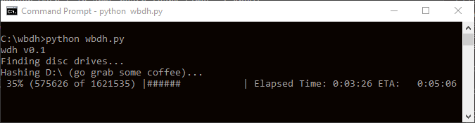

# Windows Bluray Disc Hasher

Fancy little Python script I whipped up to directly hash a physical Bluray Disc on a Windows machine. I used it once to verify that a proprietary Windows ISO ripping software was indeed producing a legitimate (not tampered with) ISO when a *nix system with a disc reader wasn't in arms reach (dark times, I know).

Tested on Python 2.7.16 and Python 3.7.2.

Install and use it like this:

```
python -m pip install -r requirements.txt
python wbdh.py
```





